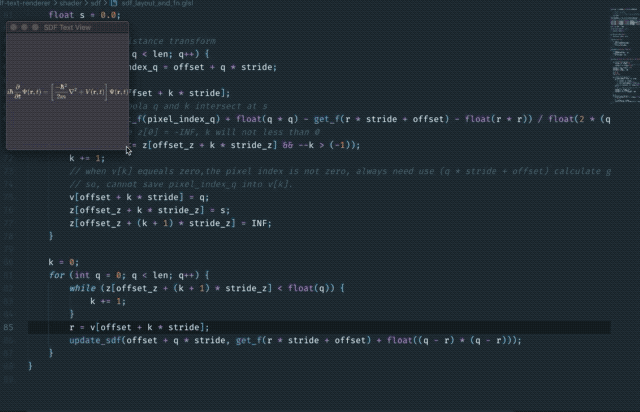
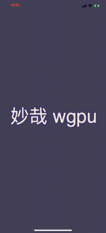

# SDFTextView
View component that based [Rust WebGPU](https://github.com/gfx-rs/wgpu-rs) to calculate SDF(signed distance field) at real time and rendering.

Also implemented a cpu-based SDF version on ```sdf-cpu/```, it accept a input image and output a sdf gray image.

## Motivation
In our iOS and Android app has lot of math LaTex content, for easy rendering reason, has been generated to png picture, the resolution of phone and tablets is very different, and if want to have a good look and feel after user zooms the picture, would need high resolution of the generated png, it is difficult to take a suitable resolution and have faster network loading speed, SDF is very suitable for solving this scenario.

## Real time performance of SDF on compute shader
Test 10 times take the average, the  
<p></p>
resolution of the input image(assets/math2.png): 368 * 130.

Device | SDF time cost
--------- | -------------
MBP 2018 (15-inch, Intel i7) |  0.390735ms
iPhone 6 plus  | 3.211291ms
iPhone Xs Max   | 0.688541ms

<p></p>
resolution of the input image(assets/large.png): 1398  * 652.

Device | SDF time cost
--------- | -------------
MBP 2018 (15-inch, Intel i7) |  0.393194ms
iPhone 6 plus  | 2.94562ms
iPhone Xs Max   | 0.784541ms

## Screenshot

|  |  |
| --------- | ------------- |


## What is SDF rendering 
SDF rendering is a technique that allows you to render bitmap fonts without jagged edges even at high magnifications. 

Original SIGGRAPH 2007 paper: [Improved Alpha-Tested Magnification for Vector Textures and Special Effects](https://steamcdn-a.akamaihd.net/apps/valve/2007/SIGGRAPH2007_AlphaTestedMagnification.pdf)

Improved algorithm: [Felzenszwalb/Huttenlocher distance transform](http://cs.brown.edu/people/pfelzens/papers/dt-final.pdf)

## Running Example
### On macOS
```
# macOS
RUST_BACKTRACE=full cargo run --example demo
# windows (not tested!)
RUST_BACKTRACE=full cargo run --example demo
# linux  (not tested!)
RUST_BACKTRACE=full cargo run --example demo
```
### On iOS 
```
# build for iOS
# debug 
RUST_BACKTRACE=1 cargo build --target aarch64-apple-ios
# release
cargo build --target aarch64-apple-ios --release
```

```swift
# usage
let metalView = MetalView()
let drawObj = create_sdf_view(metalView.appView())
sdf_view_set_bundle_image(drawObj, UnsafeMutablePointer(mutating: "math0.png"))
```

Then,use Xcode to open iOS/demo.xcworkspace and run.

### cpu-based version
```
cd sdf-generator
cargo run input.png output.png
```

## When things go wrong
- SDFTextView use ```shaderc-rs``` compile glsl to spirv, which need your compute installed ```Pathon``` 3: [wgpu-rs/pull/44](https://github.com/gfx-rs/wgpu-rs/pull/44);
- When build for iOS, ```build.rs``` will compile the specified .glsl to shader-gen/*.spv, rename glsl file maybe also need modify build.rs;
- When resizing window or rotate iOS device, the window screen flickering, because gfx filling the screen with black color when recreate a swap_chain, waiting for official repair;


## To do list
- [ ] Use Android ```SurfaceView``` to Run on Android device
- [ ] Improve screen rotate on iOS device
- [ ] Scrollable when scaled model projection  over the viewport boundaries

## License
[MIT](https://opensource.org/licenses/MIT)
