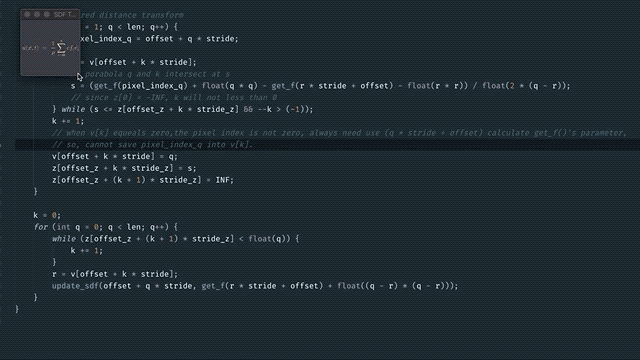

# SDFTextView
SDFTextView is a view component that based wgpu to calculate SDF(signed distance field) at real time and rendering.

Also implemented a cpu-based SDF version on ```sdf-generator/```, it accept a input image and output a sdf gray image.

## Real time performance of  SDF compute shader

Device | SDF time cost
--------- | -------------
MBP 2018 (15-inch, Intel i7) |  1.414149ms
iPhone 6 plus  | 8.211291ms
iPhone Xs Max   | 1.182791ms

## Screenshot
 | 
--------- | -------------
  | 

## What is a SDF rendering 
SDF rendering is a technique that allows you to render bitmap fonts without jagged edges even at high magnifications. 

Original SIGGRAPH 2007 paper: [Improved Alpha-Tested Magnification for Vector Textures and Special Effects](https://steamcdn-a.akamaihd.net/apps/valve/2007/SIGGRAPH2007_AlphaTestedMagnification.pdf)

Improved algorithm: [Felzenszwalb/Huttenlocher distance transform](http://cs.brown.edu/people/pfelzens/papers/dt-final.pdf)

## Running Example
### On PC
```
# macOS
cargo run --example demo
# Windows
cargo run --example demo --features dx12
```
### On iOS device
```
# build for iOS
# debug 
RUST_BACKTRACE=1 cargo build --target aarch64-apple-ios
# release
cargo build --target aarch64-apple-ios --release
```
Then,use Xcode to open iOS/demo.xcworkspace and run.

### cpu-based version
```
cd sdf-generator
cargo run input.png output.png
```